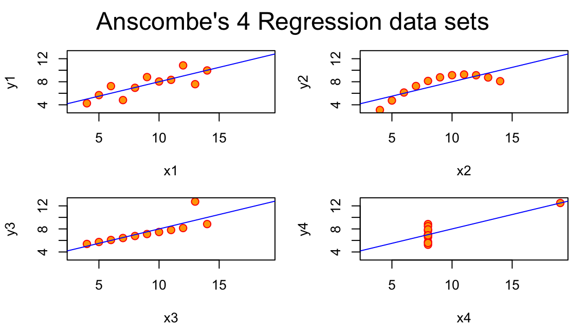
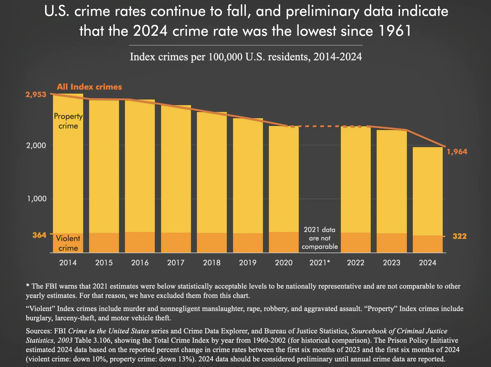

## 1. Anscombe’s Quartet

Anscombe’s four datasets may have similar statistical results, but the actual data patterns identified by graphs are very different. The first dataset shows a relatively normal linear relationship, but the second dataset shows a curved pattern. So, a simple linear regression line does not fully explain the data pattern. In the third dataset, most of the points show a consistent pattern, but one outlier strongly influences the result. Lastly, in the fourth dataset, most points are concentrated in one location, but one point strongly impacts the result. Anscombe’s four datasets show that it is difficult to fully understand the actual data pattern by just checking the mean, correlation, and regression results. Therefore, when we analyze data, it is suggested to draw graphs first and check the patterns and outliers instead of just checking the statistical results.

## 2. Fall Color

The original Fall.R graphic was reproduced with a light pink color.

## 3. Crime Rate Chart Critique

This graph shows the trend in Index crime in the United States from 2014 to 2024, and it is good to see the changes in the overall crime rate by separating violent crime and property crime. Also, it has a good point that the graph clearly indicates that the 2021 data are not comparable with other years. However, there is also a critical point: the 2024 data are not final annual data but preliminary data estimated based on the percent change between 2023 and early 2024, but they are described in almost the same way as other years’ final data. In other words, readers can misunderstand that the 2024 data are also final data like other years. Also, the title indicates that the crime rate in 2024 is the lowest since 1961, but the graph only shows crime rates from 2014 to 2024, so the readers cannot check the long-term comparison themselves through the graph. Lastly, the total height of the bar already shows the total Index crime, but showing the same value again with a line may be redundant. Therefore, the 2024 estimated numbers should be clearly distinguished using a different color or separate annotation. Also, to support the title of long-term comparison, data from a longer time period should be presented to increase the accuracy and clarity of the graph.

Source: [Prison Policy Initiative, "U.S. crime rates continue to fall, and preliminary data indicate that the 2024 crime rate was the lowest since 1961"](https://www.prisonpolicy.org/graphs/crimerates_2014_2024.html)
